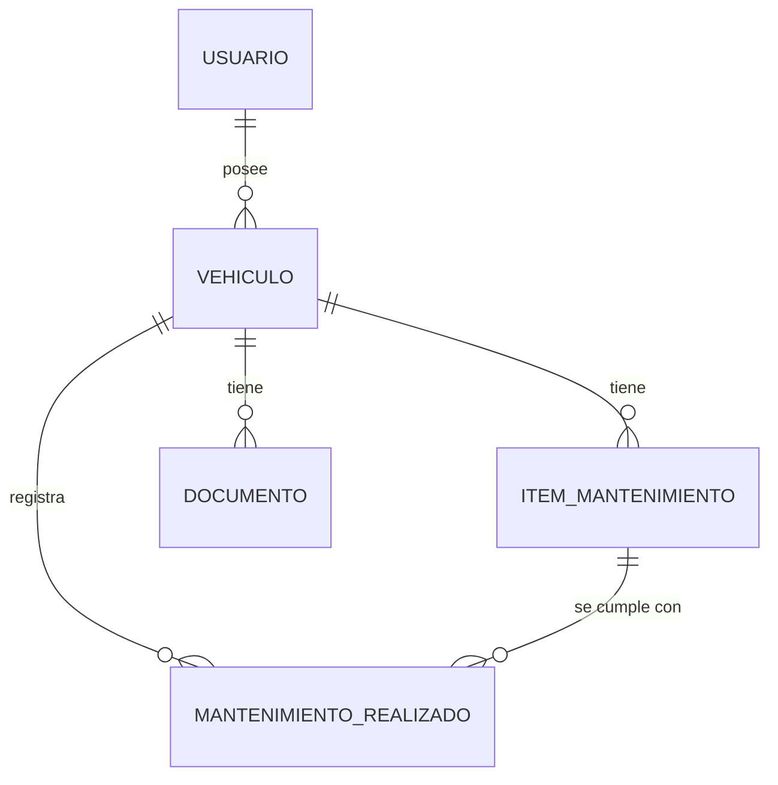
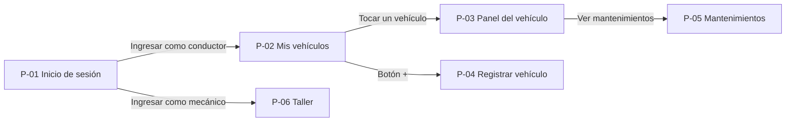
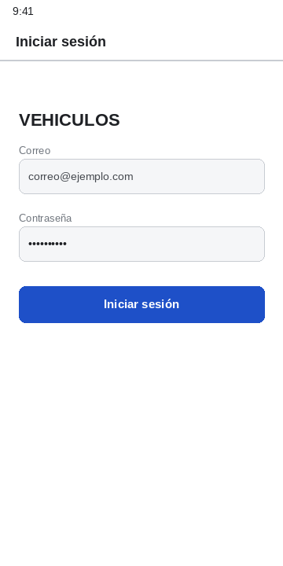
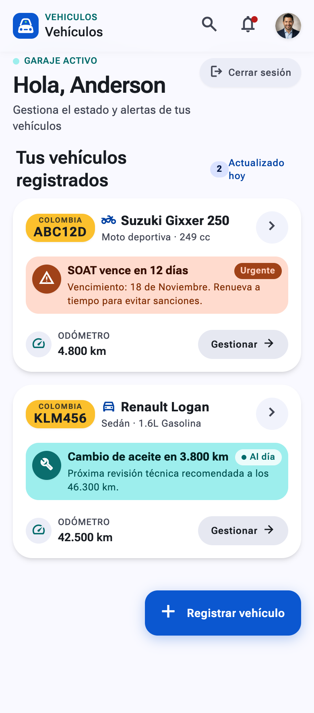
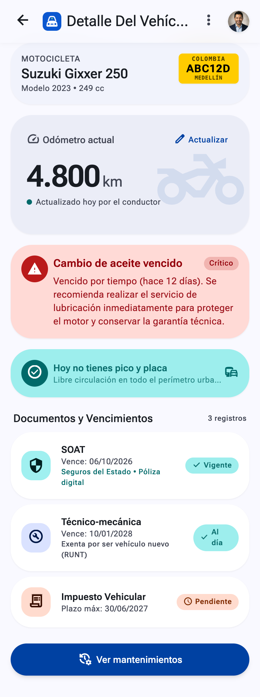
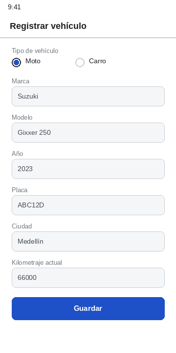
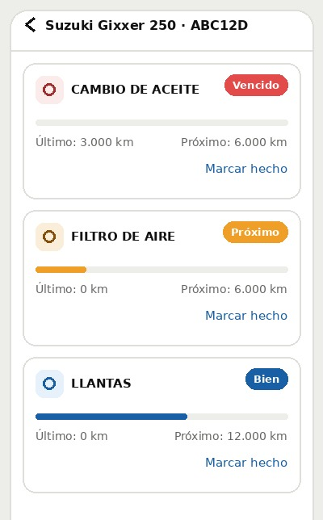
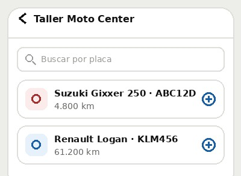

# VEHICULOS

| | |
|---|---|
| Integrantes | David Muñoz Betancur, Juan Pablo Bustos Sepúlveda, Anderson Fabián Sánchez Benítez |
| Curso y grupo | Programación Móvil (IF2004), grupo 602 |
| Versión | 1.0, 24 de septiembre de 2026 |

## Tabla de contenido

1. [Descripción general](#1-descripción-general)
2. [Problema](#2-problema)
3. [Objetivos](#3-objetivos)
4. [Stakeholders, actores y roles](#4-stakeholders-actores-y-roles)
5. [Alcance](#5-alcance)
6. [Funcionalidades](#6-funcionalidades)
7. [Requerimientos funcionales](#7-requerimientos-funcionales)
8. [Requerimientos no funcionales](#8-requerimientos-no-funcionales)
9. [Reglas de negocio](#9-reglas-de-negocio)
10. [Modelo de datos](#10-modelo-de-datos)
11. [Pantallas y mapa de navegación](#11-pantallas-y-mapa-de-navegación)
12. [Mockup](#12-mockup)
13. [Historias de usuario, casos de uso, restricciones y supuestos](#13-historias-de-usuario-casos-de-uso-restricciones-y-supuestos)
14. [Arquitectura técnica y navegación implementada](#14-arquitectura-técnica-y-navegación-implementada)
- [Historial de cambios](#historial-de-cambios)
- [Referencias](#referencias)
- [Declaración de uso de inteligencia artificial](#declaración-de-uso-de-inteligencia-artificial)

## 1. Descripción general

VEHICULOS es una app móvil para que el dueño de una moto o un carro sepa qué le vence y cuándo, sin depender de la memoria ni del mecánico. El conductor registra su vehículo con el kilometraje actual, y la app le muestra en un solo panel el próximo mantenimiento (aceite, filtros, kit de arrastre, llantas), la fecha de vencimiento de sus documentos (SOAT, revisión técnico-mecánica e impuesto) y si hoy tiene pico y placa.

La app entiende que un mantenimiento vence por kilómetros **o** por tiempo, lo que llegue primero, como lo indican los fabricantes. Por eso funciona igual para una moto que se usa todos los días y para una secundaria que recorre pocos kilómetros al mes.

Un segundo rol, el mecánico o taller, registra los mantenimientos que realiza. Así el contador de cada ítem se reinicia con el kilometraje real del cambio y no con lo que el conductor recuerda.

## 2. Problema

Hoy el dueño de un vehículo lleva el control de su mantenimiento y sus documentos de memoria, en notas sueltas o en la calcomanía del último cambio de aceite. Eso falla de dos maneras:

- **Se pasan los kilómetros.** El conductor mide el desgaste en tiempo ("hace como tres meses cambié el aceite") y no en kilómetros, que es la medida real. Una moto que se usa a diario puede pasar los 3.000 km del cambio de aceite en seis semanas, mucho antes de los tres meses que dice el manual.
- **Se pasan las fechas.** El SOAT, la revisión técnico-mecánica y el impuesto vencen una vez al año, en fechas distintas, y no hay quien avise. Circular sin SOAT vigente o sin revisión técnico-mecánica vigente es una infracción sancionada con multa e inmovilización del vehículo (Ley 769 de 2002, artículo 131). Salir un día de pico y placa también es multa.

Un caso real del equipo: a uno de los integrantes se le pasó el cambio de aceite de su Suzuki Gixxer 250. El manual lo pide cada 3.000 km o 3 meses, lo que ocurra primero. Como es una moto secundaria que anda poco, la cuenta se llevaba de memoria y por meses, no por kilómetros, y el cambio se hizo después del intervalo.

La única alternativa hoy es preguntarle al mecánico, que depende de lo que el conductor le cuente y tiene interés en que el vehículo vuelva al taller.

**Por qué una app móvil y no una hoja de cálculo o una página web:** el kilometraje se lee en el tablero, con el vehículo al frente y el teléfono en la mano. La alerta hay que verla antes de salir, no cuando uno se sienta frente al computador. Y los datos se necesitan sin conexión: en un parqueadero o en carretera no siempre hay señal.

## 3. Objetivos

### 3.1 Objetivo general

Permitir que el conductor sepa, desde su teléfono y sin depender del taller, qué mantenimiento y qué documento le vence a cada vehículo y en cuánto tiempo.

### 3.2 Objetivos específicos

- Que ningún documento ni mantenimiento venza por olvido: cada uno tiene una fecha estimada visible en el panel del vehículo con al menos 15 días de anticipación.
- Que registrar un vehículo tome menos de dos minutos y máximo seis toques después del inicio de sesión.
- Que actualizar el kilometraje tome máximo dos toques desde el panel del vehículo.
- Que el conductor vea si hoy tiene pico y placa al abrir el panel, sin buscarlo en ninguna otra parte.
- Que el reinicio del contador de un mantenimiento lo haga quien lo realizó, el taller, con el kilometraje real del cambio.

## 4. Stakeholders, actores y roles

| Actor o stakeholder | Tipo | Qué hace o qué interés tiene |
|---|---|---|
| Conductor | Rol (usa la app) | Registra sus vehículos, actualiza el kilometraje, ve el panel de cada uno y marca un mantenimiento como hecho. |
| Mecánico o taller | Rol (usa la app) | Ve los vehículos que atiende y registra un mantenimiento realizado con tipo, kilometraje y fecha. Eso reinicia el contador de ese ítem. |
| Secretaría de Movilidad | Stakeholder | Define el pico y placa y cobra el impuesto. No usa la app. |
| Aseguradoras | Stakeholder | Expiden el SOAT, cuya fecha de vencimiento se registra en la app. No usan la app. |
| Fabricantes | Stakeholder | Publican el plan de mantenimiento de cada modelo, de donde salen los intervalos. No usan la app. |

**Por qué dos roles.** El conductor sabe cuándo actualiza el kilometraje, pero en la práctica es el taller quien sabe con exactitud a qué kilómetro se hizo un cambio. Separar el rol de mecánico evita que ese dato dependa de que el conductor lo transcriba bien, y le da a la app un segundo flujo con permisos distintos.

**Login.** Correo y contraseña. El rol viene con la cuenta: una cuenta de conductor entra a Mis vehículos y una cuenta de mecánico entra al Taller. La sesión se mantiene abierta hasta que el usuario la cierra. En esta versión las cuentas son fijas en el código; no hay registro de usuarios.

## 5. Alcance

### 5.1 Incluye

- Inicio de sesión con dos roles: conductor y mecánico.
- Registro de uno o varios vehículos por conductor, de tipo moto o carro.
- Panel por vehículo con kilometraje actual, próximo mantenimiento, vencimiento de SOAT, técnico-mecánica e impuesto, y pico y placa del día.
- Lista de ítems de mantenimiento por vehículo, con intervalo en kilómetros y en meses y cuánto falta para cada uno.
- Actualización del kilometraje por el conductor.
- Registro de mantenimientos realizados por el taller.
- Datos guardados en el teléfono: la información se conserva entre una apertura y la siguiente.

### 5.2 No incluye

- Notificaciones push. En esta versión "avisar" significa mostrarlo en el panel al abrir la app.
- Chatbot, sugerencias de repuestos y comparación de componentes.
- Consulta automática de planes de mantenimiento a una API de fabricantes: los planes se cargan como datos fijos por modelo.
- Nivel de gasolina, estado de la batería, presión de llantas o cualquier dato que requiera sensores del vehículo.
- Registro de gastos, compras o pagos dentro de la app.
- Registro de nuevas cuentas de usuario y recuperación de contraseña.
- Versión para iOS y versión web.
- Pico y placa de ciudades distintas de Medellín.

## 6. Funcionalidades

**Conductor**

- Iniciar y cerrar sesión.
- Ver la lista de sus vehículos con la alerta más próxima de cada uno.
- Registrar un vehículo con tipo, marca, modelo, año, placa, ciudad y kilometraje actual.
- Ver el panel de un vehículo: kilometraje, próximo mantenimiento, documentos y pico y placa de hoy.
- Actualizar el kilometraje de un vehículo.
- Ver la lista de mantenimientos del vehículo y cuánto falta para cada uno.
- Marcar un mantenimiento como hecho.

**Mecánico**

- Iniciar y cerrar sesión.
- Ver la lista de vehículos que atiende.
- Registrar un mantenimiento realizado: vehículo, tipo, kilometraje y fecha.

## 7. Requerimientos funcionales

| ID | Requerimiento | Rol | Prioridad |
|---|---|---|---|
| RF-01 | La app debe permitir iniciar sesión con correo y contraseña y llevar al usuario a la pantalla de su rol. | Todos | Alta |
| RF-02 | La app debe permitir al conductor registrar un vehículo con tipo, marca, modelo, año, placa, ciudad y kilometraje actual. | Conductor | Alta |
| RF-03 | La app debe mostrar al conductor la lista de sus vehículos, cada uno con la alerta más próxima. | Conductor | Alta |
| RF-04 | La app debe mostrar, para el vehículo tocado en la lista, un panel con kilometraje actual, próximo mantenimiento, vencimiento de SOAT, técnico-mecánica e impuesto, y pico y placa de hoy. | Conductor | Alta |
| RF-05 | La app debe permitir al conductor actualizar el kilometraje de un vehículo. | Conductor | Alta |
| RF-06 | La app debe mostrar la lista de ítems de mantenimiento del vehículo con su intervalo en kilómetros y en meses y cuánto falta para cada uno. | Conductor | Alta |
| RF-07 | La app debe calcular el próximo vencimiento de cada ítem por kilómetros y por meses, y mostrar el que llegue primero. | Sistema | Alta |
| RF-08 | La app debe permitir marcar un mantenimiento como hecho, registrando kilometraje y fecha. | Conductor, Mecánico | Alta |
| RF-09 | La app debe mostrar al mecánico la lista de vehículos que atiende. | Mecánico | Media |
| RF-10 | La app debe permitir al mecánico registrar un mantenimiento realizado sobre un vehículo. | Mecánico | Media |
| RF-11 | La app debe indicar si el vehículo tiene pico y placa el día de hoy, según su placa y su ciudad. | Conductor | Media |
| RF-12 | La app debe conservar vehículos, ítems, documentos y mantenimientos entre una apertura y la siguiente. | Sistema | Alta |
| RF-13 | La app debe permitir al conductor ajustar el intervalo de un ítem de mantenimiento para su vehículo. | Conductor | Baja |

## 8. Requerimientos no funcionales

| ID | Categoría | Requerimiento |
|---|---|---|
| RNF-01 | Sin conexión | Toda la información se guarda en el teléfono. El panel, la lista de vehículos y los mantenimientos se ven completos sin conexión a internet. |
| RNF-02 | Rendimiento | La app abre y muestra la lista de vehículos en menos de 3 segundos en un teléfono de gama media. |
| RNF-03 | Usabilidad | Todo elemento táctil mide como mínimo 48 por 48 píxeles lógicos, y la alerta más próxima de cada vehículo se lee sin abrir el panel. |
| RNF-04 | Usabilidad | Actualizar el kilometraje toma máximo dos toques desde el panel del vehículo. |
| RNF-05 | Compatibilidad | Funciona desde Android 8.0 (API 26), en pantallas de 5 a 6,7 pulgadas, en orientación vertical. |
| RNF-06 | Seguridad | La contraseña nunca se guarda en el teléfono en texto plano. |
| RNF-07 | Consumo de datos | La app no usa la red en esta versión; no consume datos móviles. |

## 9. Reglas de negocio

- RN-01. Cada ítem de mantenimiento tiene un intervalo en kilómetros y otro en meses. Vence por el que se cumpla primero.
- RN-02. Los intervalos salen del plan de mantenimiento del modelo. El conductor puede ajustarlos para su vehículo, y el ajuste queda registrado.
- RN-03. El SOAT, la revisión técnico-mecánica y el impuesto vencen solo por fecha, una vez al año.
- RN-04. El pico y placa depende de la ciudad, del tipo de vehículo y del dígito de la placa. En Medellín rige de lunes a viernes de 5:00 a. m. a 8:00 p. m., para carros por el último dígito de la placa y para motos por el primer número, con una rotación que cambia cada semestre. En esta versión solo se aplica la regla de Medellín.
- RN-05. Al registrar un mantenimiento como hecho, desde Mantenimientos (P-05) o desde Taller (P-06), el ítem vuelve a contar desde el kilometraje y la fecha de ese registro.
- RN-06. La fecha estimada de un vencimiento por kilómetros se calcula con el promedio de kilómetros por día del vehículo, obtenido de las actualizaciones de kilometraje del conductor. Mientras no haya al menos dos actualizaciones, se muestra solo el vencimiento por meses.
- RN-07. Un vehículo pertenece a un solo conductor. Un conductor puede tener varios vehículos.
- RN-08. Un mantenimiento registrado por el taller tiene prioridad sobre uno marcado por el conductor para el mismo ítem, porque trae el kilometraje real del cambio.

## 10. Modelo de datos

| Entidad | Atributos principales | Dónde se guarda |
|---|---|---|
| Usuario | id, nombre, correo, rol (conductor o mecánico) | Teléfono. En esta versión, cuentas fijas en el código |
| Vehículo | id, usuario_id, tipo (moto o carro), marca, modelo, año, placa, ciudad, km_actual, fecha_km | Teléfono |
| ItemMantenimiento | id, vehiculo_id, nombre, intervalo_km, intervalo_meses, ultimo_km, ultima_fecha | Teléfono |
| Documento | id, vehiculo_id, tipo (SOAT, técnico-mecánica, impuesto), fecha_vencimiento | Teléfono |
| MantenimientoRealizado | id, vehiculo_id, item_id, km, fecha, registrado_por (conductor o taller) | Teléfono |

**Relaciones.** Un usuario conductor tiene muchos vehículos. Cada vehículo tiene muchos ítems de mantenimiento, muchos documentos y muchos mantenimientos realizados. Cada mantenimiento realizado corresponde a un ítem y, al crearse, actualiza `ultimo_km` y `ultima_fecha` de ese ítem (RN-05).



No hay servidor en esta versión: toda la información vive en una base de datos local en el teléfono (SQLite, cuando se vea en clase). En este primer entregable los datos son fijos en el código. Si en el futuro se agrega un servidor, el teléfono conservaría una copia local para cumplir RNF-01.

## 11. Pantallas y mapa de navegación

| ID | Pantalla | Rol | Para qué sirve | Atiende |
|---|---|---|---|---|
| P-01 | Inicio de sesión | Todos | Entrar con correo y contraseña. Según el rol, lleva a P-02 o a P-06. | RF-01, RNF-06 |
| P-02 | Mis vehículos | Conductor | Lista de vehículos del conductor con placa, modelo y la alerta más próxima de cada uno. Botón para registrar uno nuevo. | RF-03, RNF-03 |
| P-03 | Panel del vehículo | Conductor | Recibe el vehículo tocado en P-02. Muestra kilometraje actual, próximo mantenimiento, SOAT, técnico-mecánica, impuesto y pico y placa de hoy. Permite actualizar el kilometraje. | RF-04, RF-05, RF-07, RF-11 |
| P-04 | Registrar vehículo | Conductor | Formulario con tipo, marca, modelo, año, placa, ciudad y kilometraje actual. | RF-02 |
| P-05 | Mantenimientos | Conductor | Lista de ítems del vehículo con intervalo en km y meses y cuánto falta para cada uno. Permite marcar uno como hecho. | RF-06, RF-07, RF-08, RF-13 |
| P-06 | Taller | Mecánico | Lista de vehículos atendidos y formulario para registrar un mantenimiento realizado. | RF-09, RF-10, RF-08 |



Desde P-01, según el rol con el que se entra: el conductor va a P-02 y de ahí el botón "+" lleva a P-04 y tocar un vehículo lleva a P-03; desde P-03, "Ver mantenimientos" lleva a P-05. El mecánico va directo a P-06. Todas las flechas son `Navigator.push`. Desde cada pantalla se vuelve a la anterior con `Navigator.pop`, con la flecha del `AppBar` y con el botón Atrás del sistema. Desde P-02 y P-06, "Cerrar sesión" hace `pop` hacia P-01.

La sección "Documentación" del mockup de agosto quedó integrada en P-03: el SOAT, la técnico-mecánica y el impuesto se muestran ahí.

## 12. Mockup

Las imágenes están en `docs/mockup/`, una por pantalla, con el mismo identificador de la sección 11. Los mockups de agosto, hechos antes de definir el alcance, se conservan en `docs/mockup/version-agosto/`.

### P-01 Inicio de sesión



Formulario centrado con correo, contraseña y botón "Iniciar sesión". Sin enlace de registro, porque las cuentas son fijas en esta versión.

### P-02 Mis vehículos



Lista de tarjetas, una por vehículo, con placa, marca y modelo y la alerta más próxima ("Cambio de aceite en 400 km", "SOAT vence en 12 días"). Botón flotante "+" para registrar un vehículo y "Cerrar sesión" en el `AppBar`.

### P-03 Panel del vehículo



Kilometraje actual arriba, con botón para actualizarlo. Debajo, la alerta más próxima destacada, las tarjetas de SOAT, técnico-mecánica e impuesto con su fecha, y una franja que dice si hoy hay pico y placa. Botón "Ver mantenimientos".

### P-04 Registrar vehículo



Formulario con selector de tipo (moto o carro), campos de marca, modelo, año, placa, ciudad y kilometraje actual, y botón "Guardar".

### P-05 Mantenimientos



Encabezado con placa y modelo del vehículo. Lista de ítems del plan; cada fila muestra el nombre, el intervalo ("cada 3.000 km o 3 meses"), cuánto falta por kilómetros y por fecha, un color de estado (al día, próximo, vencido) y un botón "Hecho".

### P-06 Taller



Encabezado con el nombre del taller que inició sesión. Lista de vehículos atendidos por placa, modelo y dueño. Al tocar uno se llena el formulario de abajo: ítem de mantenimiento, kilometraje, fecha y botón "Registrar".

## 13. Historias de usuario, casos de uso, restricciones y supuestos

### 13.1 Historias de usuario

- **HU-01.** Como conductor, quiero registrar mi vehículo con su kilometraje actual, para que la app sepa desde dónde contar cada mantenimiento.
- **HU-02.** Como conductor, quiero ver en un solo panel qué le vence a mi vehículo y en cuánto, para no enterarme cuando ya pasó.
- **HU-03.** Como conductor, quiero actualizar el kilometraje en dos toques, para hacerlo cada vez que tanqueo sin que me dé pereza.
- **HU-04.** Como conductor, quiero saber si hoy tengo pico y placa antes de salir, para no llevarme la multa.
- **HU-05.** Como conductor con dos vehículos, quiero verlos en una sola lista con la alerta de cada uno, para no revisar uno por uno.
- **HU-06.** Como mecánico, quiero registrar el mantenimiento que acabo de hacer con el kilometraje real, para que el próximo aviso del cliente sea correcto.

### 13.2 Casos de uso

**Caso de uso 1: registrar un vehículo.**
Actor: conductor. Precondición: tiene sesión iniciada y está en Mis vehículos (P-02). Flujo: toca el botón "+", llena tipo, marca, modelo, año, placa, ciudad y kilometraje actual, y toca "Guardar"; la app crea el vehículo con los ítems de mantenimiento del plan de su modelo y vuelve a la lista, donde ya aparece. Excepción: si la placa ya está registrada, la app no guarda y muestra el mensaje "Esa placa ya existe".

**Caso de uso 2: registrar un mantenimiento realizado.**
Actor: mecánico. Precondición: tiene sesión iniciada como mecánico y el vehículo ya existe. Flujo: en Taller (P-06) toca el vehículo, elige el ítem de mantenimiento, escribe el kilometraje y la fecha, y toca "Registrar"; la app guarda el mantenimiento y reinicia el contador de ese ítem desde ese kilometraje y esa fecha (RN-05). Excepción: si el kilometraje es menor que el último registrado para ese vehículo, la app lo rechaza y lo explica.

**Caso de uso 3: ver el próximo vencimiento.**
Actor: conductor. Precondición: el vehículo tiene kilometraje registrado. Flujo: toca el vehículo en Mis vehículos; la app calcula, para cada ítem, cuánto falta por kilómetros y cuánto por meses, muestra el que llegue primero (RN-01) y destaca el más cercano en el panel. Excepción: si solo hay una actualización de kilometraje, la app no puede estimar el ritmo de uso y muestra solo el vencimiento por meses (RN-06).

### 13.3 Restricciones

- Solo Android en esta versión.
- Solo se implementa con lo visto en clase: `StatelessWidget`, `StatefulWidget`, `Scaffold`, `ListView.builder`, `TextField`, `Navigator.push` y `Navigator.pop`. Sin paquetes de navegación ni de manejo de estado.
- Los planes de mantenimiento se cargan como datos fijos por modelo; no hay consulta a fabricantes.
- El pico y placa se aplica solo con la regla de Medellín.

### 13.4 Supuestos

- El conductor conoce el kilometraje de su vehículo y lo actualiza al menos una vez al mes.
- El plan de mantenimiento del fabricante está disponible en el manual del propietario de cada modelo.
- El taller que atiende el vehículo está dispuesto a registrar el mantenimiento en la app.
- El teléfono tiene la fecha del sistema correcta; de ella dependen los vencimientos por meses y el pico y placa del día.

## 14. Arquitectura técnica y navegación implementada

**Entorno.** Flutter 3.44.9, Dart 3.12.2.

**Paquetes previstos.** Ninguno adicional en esta versión: solo el SDK de Flutter. Para guardar los datos en el teléfono en una versión futura se prevé `sqflite`, cuando se vea en clase.

**Estructura de `lib/`.**

```
lib/
  main.dart                       punto de entrada; home es P-01
  modelos/
    vehiculo.dart                 clases Usuario, Vehiculo, ItemMantenimiento y Documento, y los datos fijos de ejemplo
  pantallas/
    login.dart                    P-01
    mis_vehiculos.dart            P-02
    panel_vehiculo.dart           P-03
    registrar_vehiculo.dart       P-04
    mantenimientos.dart           P-05
    taller.dart                   P-06
  widgets/
    tarjeta_vehiculo.dart         tarjeta reutilizada en P-02 y P-06
```

**Tabla de rutas.**

| Pantalla | Archivo | Se llega desde | Recibe |
|---|---|---|---|
| P-01 | `lib/pantallas/login.dart` | Es el `home` de `main.dart` | Nada |
| P-02 | `lib/pantallas/mis_vehiculos.dart` | P-01, con `Navigator.push` al ingresar como conductor | El correo del usuario |
| P-03 | `lib/pantallas/panel_vehiculo.dart` | P-02, con `Navigator.push` al tocar un vehículo | El vehículo tocado |
| P-04 | `lib/pantallas/registrar_vehiculo.dart` | P-02, con `Navigator.push` desde el botón + | Nada |
| P-05 | `lib/pantallas/mantenimientos.dart` | P-03, con `Navigator.push` desde "Ver mantenimientos" | El vehículo |
| P-06 | `lib/pantallas/taller.dart` | P-01, con `Navigator.push` al ingresar como mecánico | El usuario mecánico (Usuario), por constructor |

**Cómo viaja el dato de la lista al detalle.** El vehículo tocado en P-02 se pasa por el constructor de P-03, como se hizo en la actividad de la semana 5:

```dart
onTap: () {
  Navigator.push(
    context,
    MaterialPageRoute(
      builder: (context) => PanelVehiculo(vehiculo: vehiculo),
    ),
  );
},
```

**Datos fijos de ejemplo.** Dos cuentas (una de conductor y una de mecánico) y dos vehículos en Medellín: una moto Suzuki Gixxer 250 (placa ABC12D) con cinco ítems tomados del plan de revisiones del manual (cambio de aceite cada 3.000 km o 3 meses; filtro de aire y bujía cada 6.000 km o 6 meses; kit de arrastre y llantas cada 12.000 km o 12 meses), y un carro Renault Logan (placa KLM456) con cambio de aceite cada 5.000 km o 6 meses y llantas cada 40.000 km o 48 meses. Con eso se muestra la regla RN-01 en la sustentación. En este entregable los objetos no llevan id: cada vehículo guarda sus ítems y sus documentos adentro, y MantenimientoRealizado todavía no existe en el código porque no hay lógica de registro. Los id, las claves foráneas y esa entidad de la sección 10 aparecen cuando los datos pasen a la base local. Las claves de las cuentas de prueba están en el código solo para la demo; RNF-06 aplica cuando exista guardado real de usuarios.

## Historial de cambios

| Fecha | Qué cambió | Quién |
|---|---|---|
| 22/08/2026 | Primer commit del proyecto Flutter. | Anderson Sánchez |
| 29/08/2026 | SRS inicial y mockups del panel, documentación, mantenimiento y mi vehículo. | Anderson Sánchez, David Muñoz |
| 24/09/2026 | Migración del SRS a este documento con las 14 secciones. Se definen dos roles, seis pantallas y el mapa de navegación. Se saca del alcance el chatbot, la API de fabricantes y los datos de sensores. El SRS pasa a `docs/srs-agosto.md` y los mockups de agosto a `docs/mockup/version-agosto/`. | Anderson Sánchez |
| 25/09/2026 | Pantallas P-01 y P-04 y mockups p01 y p04. | Juan Pablo Bustos |
| 25/09/2026 | Pantallas P-05 y P-06. | David Muñoz |
| 25/09/2026 | Pantallas P-02 y P-03, mockups p02 y p03. | Anderson Sánchez |
| 25/09/2026 | Navegación: main.dart arranca en P-01 y el login lleva a P-02 o P-06 según el rol. | Juan Pablo Bustos |
| 26/09/2026 | Navegación de P-02 a P-03 y P-04, y de P-03 a P-05. Cerrar sesión con pop. | Anderson Sánchez |

## Referencias

- Oscar Sánchez, "Semana 5. Navegación entre pantallas", curso IF2004, 2026-02. Usada para la sección 14 y para el patrón de paso de datos por constructor. Enlace: https://oscarleosanchez.github.io/sitio-iue-2026-02/movil/semana-05/
- Flutter, "Navigation and routing". Usada para la sección 14. Enlace: https://docs.flutter.dev/ui/navigation
- Congreso de Colombia, Ley 769 de 2002, Código Nacional de Tránsito Terrestre, artículo 131. Usada para la sección 2. Enlace: http://www.secretariasenado.gov.co/senado/basedoc/ley_0769_2002.html
- Alcaldía de Medellín, Secretaría de Movilidad, "Pico y placa". Usada para RN-04 y RF-11: horario, dígito que aplica a carros y a motos, y rotación semestral. Enlace: https://www.medellin.gov.co/es/secretaria-de-movilidad/pico-y-placa/
- Suzuki, manual del propietario de la Gixxer 250, plan de mantenimiento periódico. Usada para RN-01, RN-02 y los datos fijos de la sección 14. Manual impreso que acompaña la moto.

## Declaración de uso de inteligencia artificial

**Herramientas.** Claude (Anthropic), en la interfaz de chat y en Claude Code.

**Para qué se usó.**

- Estructura de este documento: Claude organizó en las 14 secciones de la plantilla el contenido del SRS que el equipo escribió en agosto (problema, stakeholders, objetivos, reglas y casos de uso).
- Primer borrador de las secciones 4 y 6 a 14, a partir de las decisiones que el equipo tomó el 23 y el 24 de septiembre: los dos roles, las seis pantallas, la regla "kilómetros o meses, lo que llegue primero", el caso real del cambio de aceite y el plan de mantenimiento de la Gixxer 250.
- Reorganización del repositorio a la estructura que pide la actividad, las clases de `lib/modelos/vehiculo.dart` y el esqueleto de las pantallas, con Claude Code, pidiendo explicación de cada parte antes de aceptarla.
- Navegación de las pantallas P-02 y P-03 con Claude Code, pidiendo la explicación de la pila en cada salto y por qué el vehículo tocado es el que llega al panel.

**Qué aceptamos.** La separación entre documentos, que vencen por fecha, y mantenimientos, que vencen por kilómetros o meses. El rol de mecánico como quien reinicia el contador con el kilometraje real. La estructura de seis pantallas y el mapa de navegación.

**Qué corregimos.** Un borrador de las secciones 6 a 9 se había escrito con otra numeración (roles, pantallas, reglas y modelo); se reacomodó a la plantilla y sus aportes (por qué dos roles, el uso de SQLite y las descripciones de P-05 y P-06) se integraron en las secciones 4, 10 y 12.

**Qué descartamos.** Una pantalla aparte de Documentación (P-07): se integró en el panel del vehículo. Las notificaciones push para esta versión.

**Qué escribimos nosotros.** El problema original y los stakeholders del SRS de agosto, la elección del tema y de los roles, el caso real de la sección 2, los mockups, las referencias y el código de las pantallas.
